# 🔍 StellarSearch — Pay-Per-Query Web Search for AI Agents

> **Stellar Hackathon 2026 · Agents on Stellar**
> Zero mock data. Real x402 payments. Real Serper.dev Search. Real Groq AI. Real Freighter wallet.

[](./LICENSE)

---

## Demo



A self-contained animated walkthrough of the real UI, state-for-state:
**connect Freighter → search → HTTP 402 → sign the Soroban auth entry → retry with `X-PAYMENT` → the facilitator settles `0.001 USDC` on Stellar testnet → results render with the settlement linked to Stellar Expert.**

It renders inline on GitHub with no local setup and is only ~20 KB. It is an
illustration of the flow, not a screen recording — to capture a full video of a
live settlement (with the transaction verifiable on the explorer), follow
[`docs/DEMO_RECORDING.md`](docs/DEMO_RECORDING.md).

---

## What it is

StellarSearch is a pay-per-query web search API for autonomous AI agents. Every paid request costs **0.001 USDC**, settled on Stellar in ~5 seconds using the x402 protocol. No subscriptions, no API keys for the end user — agents pay per request and get real web, image, and news results back.

---

## Endpoints

Base URL: `http://localhost:3001` (Express server) or `/api` (Vercel serverless functions).

| Endpoint | Method | Price | Description |
|---|---|---|---|
| `/search` | `GET` | **0.001 USDC** (x402) | Web search via Serper.dev. Params: `q` (required, ≤256 chars), `count` (default 5, max 20), `freshness` (`pd`/`pw`/`pm`), `suggestions=1` for Groq-powered related queries |
| `/images` | `GET` | **0.001 USDC** (x402) | Image search via Serper.dev. Returns `imageUrl`, `thumbnailUrl`, `sourceUrl`, dimensions. Params: `q` (required), `count` (default 10, max 10) |
| `/news` | `GET` | **0.001 USDC** (x402) | News search via Serper.dev. Returns articles with `title`, `url`, `snippet`, `source`, `publishedAt`. Params: `q` (required), `count` (default 10, max 20), `freshness` (`pd`/`pw`/`pm`) |
| `/ai/chat` | `POST` | Free | Groq Llama 3.3 70B assistant. JSON body `{ messages: [...] }`. Streams SSE when `Accept: text/event-stream` or `?stream=1` |
| `/health` | `GET` | Free | Live server stats: uptime, total queries, USDC settled, avg latency, API key configuration status |
| `/` | `GET` | Free | Service metadata and endpoint index |

All three paid routes use the same x402 config — 0.001 USDC, `stellar:testnet`, `payTo` = `STELLAR_RECEIVING_ADDRESS`, settled through the configured facilitator.

```bash
# Paid routes — each returns 402 until paid, then 200 with results
curl "http://localhost:3001/search?q=stellar+x402&count=5"
curl "http://localhost:3001/images?q=stellar+explorer"
curl "http://localhost:3001/news?q=stellar+news&freshness=pw"

# Free routes
curl -X POST http://localhost:3001/ai/chat \
  -H 'Content-Type: application/json' \
  -d '{"messages":[{"role":"user","content":"Summarize x402 in one sentence"}]}'
curl http://localhost:3001/health
```

---


For full endpoint parameters, response shapes, and error codes, see [`docs/api.md`](docs/api.md).


## Real stack (no mocks)

| Layer | Real package / service |
|---|---|
| Payment protocol | `@x402/express` + `@x402/stellar` + `@x402/core` |
| Blockchain | Stellar Testnet (via Horizon API) |
| Facilitator | x402 facilitator (`FACILITATOR_URL`, default `https://www.x402.org/facilitator`) |
| Wallet connect | `@stellar/freighter-api` (real Freighter extension) |
| Balances / tx | Stellar Horizon REST API (live, not mocked) |
| Search results | Serper.dev API (real Google search results) |
| AI assistant | `groq-sdk` · Llama 3.3 70B (real Groq API) |
| Frontend | React 18, TypeScript, Tailwind CSS, Framer Motion |

---

## Setup

> **Note on Mainnet:** If you are preparing to transition this project to the Stellar Mainnet, please read our [Mainnet Transition Guide](docs/mainnet.md) for critical safety checklists and requirements.

### 1. Clone and install

```bash
git clone https://github.com/StellarAgent-AI-Agent-Payment-Rails/Stellar-searchss.git
cd Stellar-searchss
npm install
```

### 2. Get your keys (all free)

| Key | Where to get it |
|---|---|
| `STELLAR_RECEIVING_ADDRESS` | [Stellar Lab](https://laboratory.stellar.org/#account-creator?network=test) — generate + fund testnet keypair |
| `SERPER_API_KEY` | [serper.dev](https://serper.dev/) — free tier: 2.5k queries/month |
| `GROQ_API_KEY` | [console.groq.com/keys](https://console.groq.com/keys) — free |

No facilitator API key is required — `FACILITATOR_URL` defaults to the public
`https://www.x402.org/facilitator` endpoint (see `.env.example`).

### 3. Configure

```bash
cp .env.example .env
# Fill in the keys above
```

### 4. Install Freighter

Install the [Freighter browser extension](https://freighter.app), create a testnet wallet, and fund it with USDC — see [Get testnet USDC](#get-testnet-usdc) below.

### 5. Run

```bash
# Terminal 1 — backend
npm run server

# Terminal 2 — frontend
npm run dev
# → http://localhost:5173
```

### Response compression

The Express server compresses eligible responses when the client advertises a
supported encoding. The `/ai/chat` SSE endpoint is excluded so streamed events
are delivered immediately. On Vercel, the CDN applies response compression at
the network edge automatically; the Express middleware is for deployments that
run this server directly.

To measure gzip savings on a captured search response without making another
paid request, save its JSON body and run
`node scripts/measure-compression.mjs < search-response.json`.

### 6. Test the x402 flow

Default mode is **free** — it asserts request validation, `/health`, and that
`/search` enforces payment (expects HTTP 402). It settles nothing and exits
non-zero if any check fails:

```bash
npm run test:search "Stellar blockchain"
```

Full paid flow (**spends testnet USDC**, ~0.001 USDC per search, up to ~0.003
USDC per run). Requires a funded testnet payer key in `.env`:

```bash
# .env:
STELLAR_PAYER_SECRET=S...  # testnet account with XLM + USDC trustline + balance
npm run test:search "Stellar blockchain" -- --paid
```

Human-readable result listings appear only with `--verbose`; `--json` prints a
machine-readable summary. See `scripts/test-search.ts -- --help`.

---

## Deployment (Vercel)

StellarSearch deploys as a static Vite frontend plus the Vercel serverless
functions in `api/`. `vercel.json` (committed) supplies the build command
(`npm run build`), the output directory (`dist`), the install command, and the
`/api/*` and SPA rewrites, so the dashboard build settings can stay at their
defaults. No separate backend host is required.

### 1. Import the project

1. Push your fork to GitHub.
2. In Vercel, **Add New → Project** and import the repository. Vercel detects the
   Vite framework from `vercel.json`; leave the build and output settings as they
   are.
3. Add the environment variables below under **Settings → Environment
   Variables** for the **Production** environment. Add **Preview** too if you
   want working preview deployments.

### 2. Environment variables

`.env.production` is the committed reference for this list. Treat it as a
template — set the real values in **Vercel → Settings → Environment Variables**,
not in the file. Vercel does not load a committed `.env.production` for the
serverless functions; only the `VITE_*` entries are read by Vite at build time,
so keep those in sync with the values in your Vercel project (or delete them from
your fork and set everything in Vercel).

Variables prefixed `VITE_` are **build-time**: Vite inlines them into the static
bundle, so changing one requires a redeploy. Every other variable is **runtime**:
it is read per request by the `api/` functions. Redeploy after changing either
kind so both the bundle and the functions pick up the new values.

| Variable | Required | Build-time / runtime | Purpose | Example |
|---|---|---|---|---|
| `STELLAR_RECEIVING_ADDRESS` | **Yes** | Runtime | `payTo` account that receives 0.001 USDC for every paid query | `G…` (your funded testnet keypair) |
| `SERPER_API_KEY` | **Yes** | Runtime | Serper.dev key backing `/api/search` | `your_serper_api_key_here` |
| `GROQ_API_KEY` | **Yes** | Runtime | Groq key for `/api/ai/chat` and AI summaries | `gsk_…` |
| `STELLAR_NETWORK` | No | Runtime | Network the functions settle on. Default `stellar:testnet` | `stellar:testnet` |
| `FACILITATOR_URL` | No | Runtime | x402 facilitator that verifies and settles payments. Default `https://www.x402.org/facilitator` | `https://www.x402.org/facilitator` |
| `VITE_STELLAR_NETWORK` | No | **Build-time** (`VITE_`) | Network inlined into the browser bundle. Keep it equal to `STELLAR_NETWORK` | `stellar:testnet` |
| `VITE_SERVER_URL` | No | **Build-time** (`VITE_`) | API base the browser calls. Use the relative `/api` on Vercel | `/api` |
| `PAYMENTS_DISABLED` | No | Runtime | Load-testing escape hatch for local runs only. Never set it in production | `true` |

`NODE_ENV` and `VERCEL_ENV` are injected by Vercel and read by `api/search.ts` to
keep the payment gate on in production — do not set them yourself.

Missing a **Yes** variable degrades the feature rather than hiding it: without
`SERPER_API_KEY` the paid search route returns an upstream error, without
`GROQ_API_KEY` the AI chat fails, and without `STELLAR_RECEIVING_ADDRESS` the
402 response has no `payTo` for the agent to pay.

### 3. Deploy

Deploy from the Vercel dashboard, or from the CLI:

```bash
npm run deploy        # npm run build && vercel --prod
```

### 4. Post-deploy verification checklist

Replace `<your-app>` with your Vercel domain, then confirm each item:

- [ ] `curl -s https://<your-app>.vercel.app/api/health` returns `200` with
      `"status":"ok"`, a `network` matching your target, and
      `receivingAddressConfigured`, `serperApiConfigured`, and
      `groqApiConfigured` all `true`.
- [ ] `curl -i "https://<your-app>.vercel.app/api/search?q=stellar"` returns
      `402` with a `PAYMENT-REQUIRED` header — proof the x402 gate is active and
      unpaid requests do not return results.
- [ ] `curl -s -X POST https://<your-app>.vercel.app/api/ai/chat -H 'Content-Type: application/json' -d '{"messages":[{"role":"user","content":"Summarize x402"}]}'`
      returns a JSON completion rather than a `500`.
- [ ] The site loads and its network badge matches `STELLAR_NETWORK` /
      `VITE_STELLAR_NETWORK`.
- [ ] Connect Freighter on testnet, run a search, approve the Soroban auth
      entry, and confirm results render with a `TX HASH` that opens a confirmed
      transaction on [Stellar Expert testnet](https://stellar.expert/explorer/testnet).
- [ ] `/api/health`'s `facilitator` value equals `FACILITATOR_URL`.
- [ ] The browser Network tab / page source contains **no** value of
      `STELLAR_RECEIVING_ADDRESS`, `SERPER_API_KEY`, or `GROQ_API_KEY` (only
      `VITE_*` values may appear in the bundle).

To move the deployment to mainnet, work through [`docs/mainnet.md`](docs/mainnet.md)
before changing `STELLAR_NETWORK`.

### Other runtimes (optional)

These are not needed for the Vercel frontend + `api/` deployment, but the MCP
server, the self-hosted Express server, and the CLI tests read them:

| Variable | Required | Used by | Purpose | Example |
|---|---|---|---|---|
| `SEARCH_API_URL` | No | MCP server, CLI tests | Absolute API base the MCP search/stats tools call. Must include `/api` on Vercel. Default `http://localhost:3001` | `https://your-app.vercel.app/api` |
| `ALLOWED_ORIGINS` | No | Express server (self-host) | Comma-separated browser origins allowed when `NODE_ENV=production` | `https://your-app.vercel.app` |
| `PORT` | No | Express server (self-host) | Port for `npm run server`. Default `3001` | `3001` |
| `DEBUG_BANNER` | No | Express server (self-host) | `1` prints the full receiving address in the startup banner | `1` |
| `STELLAR_PAYER_SECRET` | No | CLI paid test | Testnet secret used by `npm run test:search -- --paid` | `S…` |
| `SOROBAN_RPC_URL` | No | CLI paid test | Soroban RPC endpoint for the paid test. Default `https://soroban-testnet.stellar.org` | `https://soroban-testnet.stellar.org` |

`.env.example` also carries two optional placeholders for an external serverless
stats store. No code currently reads them, so they are not required and are
omitted from the tables above; set them only if you later wire that store up.

---

## Get testnet USDC

Searches are paid in USDC on Stellar testnet. A fresh wallet holds **zero USDC**, and unlike XLM there is no automatic faucet — you must opt in by adding a **trustline** before any USDC can land in your account. Complete these four steps in order; the faucet only works after step 3. (The same guide is available in-app on the **How it works** page at `/docs#get-testnet-usdc`.)

### Step 1 — Create a testnet account

Generate a keypair with the [Freighter browser extension](https://freighter.app), or use [Stellar Lab](https://lab.stellar.org/account/fund). Keep the secret key (`S…`) private — it never needs to leave your device.

### Step 2 — Fund the account with testnet XLM

A new account must hold the minimum balance before it can hold assets. Friendbot tops up your account with free testnet XLM in one click:

- **Browser:** [Stellar Lab → Fund account](https://lab.stellar.org/account/fund)
- **CLI:** `curl "https://friendbot.stellar.org?addr=G…"`

### Step 3 — Add the USDC trustline

Trust the USDC issuer so your account can hold USDC. The testnet USDC issuer used by this app (and by the faucet) is:

```
USDC-GBBD47IF6LWK7P7MDEVSCWR7DPUWV3NY3DTQEVFL4NAT4AQH3ZLLFLA5
```

You can verify the issuer on [StellarExpert](https://stellar.expert/explorer/testnet/asset/USDC-GBBD47IF6LWK7P7MDEVSCWR7DPUWV3NY3DTQEVFL4NAT4AQH3ZLLFLA5).

- **Browser:** [Stellar Lab → Fund account](https://lab.stellar.org/account/fund) has a trustline button on the same page.
- **SDK:** follow Circle's [USDC trustline quickstart](https://developers.circle.com/stablecoins/quickstart-setup-usdc-trustline-stellar) to submit a `changeTrust` operation with `@stellar/stellar-sdk`.
- **Concepts:** see [Stellar Docs — trustlines](https://developers.stellar.org/docs/learn/fundamentals/stellar-data-structures/accounts#trustlines).

> If you add a trustline to the wrong issuer, faucet USDC will never arrive. Double-check the address above.

### Step 4 — Claim testnet USDC from the faucet

Once the trustline exists, Circle's public [testnet faucet](https://faucet.circle.com) sends free testnet USDC straight to your address (currently 20 USDC per address every 2 hours). That balance is what pays for searches — **0.001 USDC per query**.

---

## How the x402 payment flow works

The same middleware guards all three paid routes — `/search`, `/images`, and `/news`:

```
Agent (wallet)          Server (Express)              Facilitator          Serper.dev
     │                       │                            │                    │
     │── GET /search?q=… ───▶│                            │                    │
     │                       │                            │                    │
     │◀── 402 + payment ─────│  x402 middleware            │                    │
     │    requirements       │  (price/network/payTo)     │                    │
     │                       │                            │                    │
     │  sign Soroban auth entry (Freighter prompt)         │                    │
     │                       │                            │                    │
     │── GET /search ───────▶│                            │                    │
     │   + X-Payment: <sig>  │                            │                    │
     │                       │── verify + settle 0.001 ──▶│                    │
     │                       │       USDC on Stellar      │                    │
     │                       │◀── settlement confirmed ───│                    │
     │                       │── POST /search ─────────────────────────────────▶│
     │◀── 200 + results ────│◀── organic results ──────────────────────────────│
     │   + txHash            │                            │                    │
```

The same handshake applies to `GET /images` and `GET /news` — only the upstream
Serper endpoint changes (`/search`, `/images`, `/news` respectively). `POST /ai/chat`
and `GET /health` are not payment-gated.

```
Claude Code / any MCP client
     │
     ├── web_search      → GET /search  → 0.001 USDC  → Serper.dev /search
     ├── image_search    → GET /images  → 0.001 USDC  → Serper.dev /images
     ├── news_search     → GET /news   → 0.001 USDC  → Serper.dev /news
     ├── ai_summarize    → Groq directly (free)
     ├── check_balance   → Stellar Horizon REST (free)
     └── get_search_stats→ GET /health (free)
```

1. Agent hits a paid route — the `@x402/express` middleware intercepts
2. Returns `HTTP 402 Payment Required` with price + network + `payTo` address
3. The x402 client signs a Soroban authorization entry via Freighter wallet
4. Retries with `X-Payment` header containing the signed entry
5. The facilitator verifies the signature and settles 0.001 USDC on Stellar testnet
6. Server receives confirmation and forwards the query to Serper.dev
7. Results are returned with the `txHash` from the `X-Payment-Response` header

The MCP server sits in front of the same Express routes, so an agent using Claude Code
pays through the identical x402 flow.

> **Security:** payment *is* authentication in this project — there are no accounts, sessions, or API
> keys, so the security of the payment flow is the security of the product. The trust boundaries
> between client, server, facilitator, and the Stellar network are documented in the
> **[payment flow threat model](docs/threat-model.md)**, which also enumerates the known attacks and
> mitigations. See [`SECURITY.md`](SECURITY.md) for the security policy and reporting process.

---

## Project structure

```
stellar-search/
├── src/                                # React frontend (Vite + TS)
│   ├── App.tsx                         # Router + layout
│   ├── main.tsx                        # Entry point
│   ├── index.css                       # Tailwind entry
│   ├── components/
│   │   ├── ai/
│   │   │   └── GroqAssistant.tsx       # Real Groq AI chat (SSE streaming)
│   │   ├── layout/
│   │   │   ├── AnimatedBackground.tsx  # Canvas animation
│   │   │   ├── Navbar.tsx
│   │   │   ├── LiveTicker.tsx
│   │   │   └── Footer.tsx
│   │   ├── search/
│   │   │   ├── SearchBar.tsx
│   │   │   ├── SearchResults.tsx       # Web / image / news result renderers
│   │   │   ├── SearchSuggestions.tsx   # Groq related-query chips
│   │   │   └── PaymentFlowVisualizer.tsx
│   │   ├── ui/
│   │   │   ├── StatsGrid.tsx           # Polls real /health endpoint
│   │   │   └── ZeroBalanceBanner.tsx
│   │   └── wallet/
│   │       └── WalletPanel.tsx         # Real Freighter connect + live balances
│   ├── hooks/
│   │   ├── useFreighterWallet.ts       # Real Freighter + Horizon integration
│   │   └── useSearch.ts                # Calls /search, /images, /news
│   ├── lib/
│   │   ├── constants.ts                # Network, Horizon, USDC, AMOUNT_USDC
│   │   └── stellar.ts                  # Horizon helpers
│   ├── pages/
│   │   ├── SearchPage.tsx
│   │   ├── DocsPage.tsx
│   │   └── DashboardPage.tsx           # Live Horizon tx history
│   └── types/index.ts
├── server/                             # Express + x402 backend (npm run server)
│   ├── index.ts                        # /search, /images, /news, /ai/chat, /health
│   ├── corsConfig.ts                   # CORS allow-list from env
│   └── logger.ts                       # Winston payment logging
├── api/                                # Vercel serverless mirror of the paid routes
│   ├── index.ts                        # Service metadata
│   ├── search.ts                       # GET /api/search — x402 protected
│   ├── health.ts                       # GET /api/health
│   └── ai/chat.ts                      # POST /api/ai/chat — Groq
├── mcp-server/
│   └── index.ts                        # MCP tools (see below)
├── scripts/
│   └── test-search.ts          # End-to-end test script
├── docs/
│   └── threat-model.md         # Payment flow trust boundaries and attack analysis
├── .env.example
├── vercel.json                 # Committed build + routing config
├── claude_mcp.json
├── SECURITY.md
└── README.md
```

### MCP tools

`mcp-server/index.ts` exposes six tools to any MCP client:

| Tool | Backing route | Price |
|---|---|---|
| `web_search` | `GET /search` | 0.001 USDC |
| `image_search` | `GET /images` | 0.001 USDC |
| `news_search` | `GET /news` | 0.001 USDC |
| `ai_summarize` | Groq API directly | Free |
| `check_balance` | Stellar Horizon REST | Free |
| `get_search_stats` | `GET /health` | Free |

---

## Claude Code / MCP integration

The MCP server can use either your local API or the hosted StellarSearch API. The [`claude_mcp.json`](claude_mcp.json) example includes both entries; keep or enable the one you want to use. Run the config from the repository root after installing dependencies with `npm install`.

The example uses `npx tsx ./mcp-server/index.ts` because the MCP server is written in TypeScript. `tsx` runs the source directly without a compilation step, and is available through this project's dependencies. Alternatively, build or bundle the MCP entry point as JavaScript with Node-resolvable imports, then configure the MCP client to run that generated file with `node`. `tsconfig.server.json` covers server and MCP code and emits to `dist`; the default `npm run build` builds the frontend and does not compile the MCP server.

The MCP server reads these environment variables:

| Variable | Required | Description |
|---|---|---|
| `GROQ_API_KEY` | Yes | Groq API key used by the `ai_summarize` tool. The Groq client is initialized when the MCP server starts, so provide a key even if you only plan to use other tools. |
| `SEARCH_API_URL` | No | Base URL for the StellarSearch API used by search and stats tools. Defaults to `http://localhost:3001`. For the hosted service, use `https://stellar-search-2twg.vercel.app/api`. |

The local entry expects the API server to be running on port 3001. The hosted entry connects to the deployed API and does not require a local API server. Both still require a Groq key for the MCP process to start.

Then tell Claude Code: `"Search for the latest Stellar x402 examples"` — it calls `web_search`, the server pays via x402, and Claude gets real results.

### `summarize_url` (free)

`summarize_url` lets an agent read a link it found: it fetches the page, strips the HTML to text and summarises it with Groq. It takes `url` and an optional `instruction` (e.g. "extract the pricing table"). The MCP tool calls the server's `POST /summarize-url`:

```bash
curl -X POST http://localhost:3001/summarize-url \
  -H 'Content-Type: application/json' \
  -d '{"url": "https://developers.stellar.org/docs"}'
```

**Free, not paid.** Like `ai_summarize` and `/ai/chat`, it only costs a Groq call and no Serper query, so it isn't behind x402. If it needs to be paid later, add `POST /summarize-url` to `x402Routes` in `server/index.ts`.

**Limits and SSRF protection.** Fetching arbitrary URLs from the server is an SSRF risk, so:

- only `http`/`https` on ports 80 and 443, with no credentials in the URL
- `localhost`, `*.local`, `*.internal` and private, loopback, link-local (including `169.254.169.254`), CGNAT, multicast and other reserved IPv4/IPv6 ranges are refused with `403`
- the address check runs on the IP the socket actually connects to, so a public hostname that resolves (or is rebound) to an internal IP is refused too
- redirects are followed up to 3 times, and every hop is checked again
- only `text/html` / `text/plain` responses; a 10 s timeout; at most 1 MB downloaded and 12,000 characters sent to the model (the response says `truncated: true` when it was cut)

Run the tests with `npm run test:url`.

### MCP prompts

The server also exposes reusable prompt templates that show up in MCP clients' prompt pickers. Each one wires up the right tool with sensible defaults:

| Prompt | Arguments | Tool used | What it does |
|---|---|---|---|
| `cited_research` | `topic` (required), `depth` (optional, default `3`) | `web_search` | Researches a topic and returns a cited summary with sources |
| `competitive_comparison` | `company_a`, `company_b` (required) | `web_search` | Compares two companies side by side with sourced facts |
| `news_roundup` | `topic` (required), `timeframe` (optional, default `last 7 days`) | `web_search` | Summarizes recent news on a topic with links |

Example: pick `cited_research`, enter `topic: "Stellar x402 adoption"`, and the client issues a `web_search` call with a research-oriented query.

### Tools and resources

Alongside its tools (`web_search`, `image_search`, `news_search`, `ai_summarize`, `check_balance`, `get_search_stats`), the server exposes live server stats as an MCP **resource**:

| Type | Name | Description |
|---|---|---|
| Resource | `stellar-search://health` | Live server stats as JSON (`application/json`), backed by `GET /health` |
| Tool | `get_search_stats` | The same stats, formatted for a chat reply |

Server stats are reference data, so they fit the resource model better than a tool: a client can surface them without a model deciding to spend a tool call on it. Clients that support resources can list and read it directly:

```json
// resources/list
{
  "resources": [
    {
      "uri": "stellar-search://health",
      "name": "stellar-search-health",
      "mimeType": "application/json"
    }
  ]
}
```

Then tell Claude Code: `"Search for the latest Stellar x402 examples"` — it calls `web_search`, the server pays via x402, and Claude gets real results. The same client can call `image_search` and `news_search` for visual and current-events lookups.

---

## Hackathon requirements

| Requirement | ✓ |
|---|---|
| Open-source repo + README | ✅ |
| 2–3 min video demo | Record showing: connect Freighter → search → see 402 → payment settles → results |
| Real Stellar testnet transactions | ✅ Every paid request (`/search`, `/images`, `/news`) settles 0.001 USDC via the x402 facilitator |
| x402 protocol | ✅ `@x402/express` + `@x402/stellar` |
| Addresses explicit demand signal | ✅ "pay-per-query web search instead of monthly subscriptions" |

---

## License

Released under the [MIT License](./LICENSE). © 2026 StellarSearch contributors.
